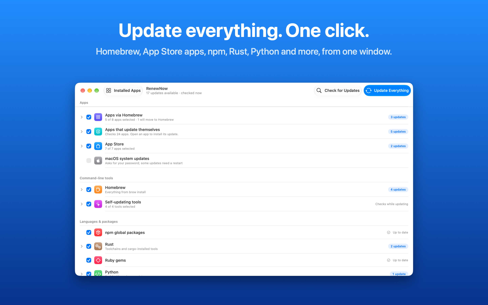
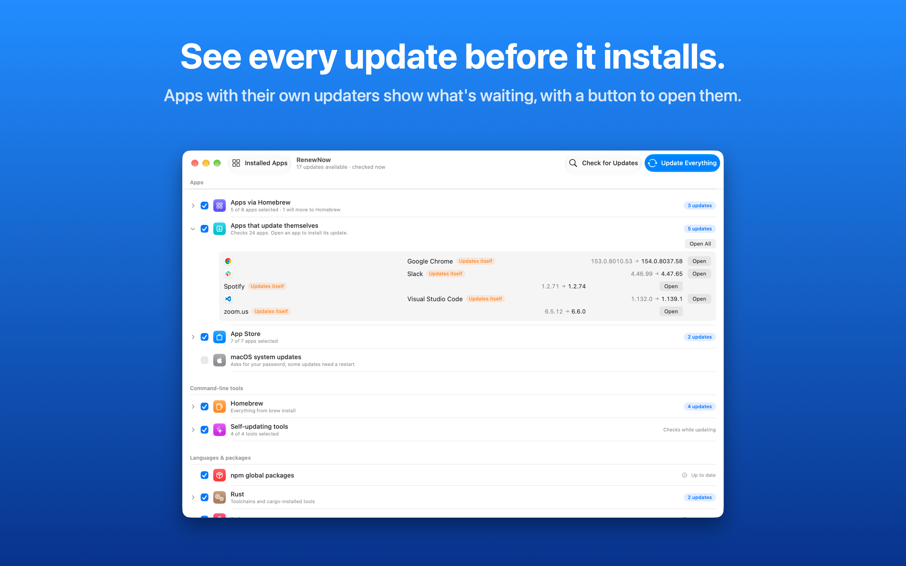

# RenewNow

**Update everything on your Mac with one click.** Free, from [tumiOS](https://tumios.com).

RenewNow finds the package managers and apps you already use, shows exactly what would change, and updates them together, from one window or the menu bar.

## Download

**[Download the latest version](../../releases/latest)**: open the `.dmg` and drag RenewNow to Applications.

Requires a Mac with Apple silicon and macOS 14 or later. The app is signed and notarized by Apple.

## What it updates

- **Homebrew**, and the Mac apps you installed with it
- **App Store apps**, through the open source [mas](https://github.com/mas-cli/mas) tool
- **Command line tools that update themselves**, such as Claude Code, found in your home folder
- **npm** global packages
- **Rust** toolchains and cargo installed tools
- **Ruby** gems
- **Python**: pip, plus the outdated packages of any install you choose
- **macOS** system updates, when you turn them on

## Check first, then choose

- **Check for Updates** shows every pending update, old version to new, before anything installs.
- A checkbox for every source and every app; unchecked ones are left alone.
- Update everything at once, or hover any row and update just that one.
- Apps that are open are never updated out from under you.
- Apps with their own updaters, like Chrome or Slack, show when an update is waiting, with **Open** and **Open All** buttons so their updaters can run.

## Remove apps you don't use

**Installed Apps** (⇧⌘A) lists every app with its size and when you last opened it. Move the ones you no longer want to the Trash together with their settings, caches and other files, so nothing is left behind. Everything goes to the Trash, so you can change your mind.

## Always up to date

A menu bar icon shows how many updates are waiting, and RenewNow can check every day or every week, and open at login.

## Privacy

No account, no analytics, no tracking. Nothing about you or your Mac is sent to tumiOS. To check versions, RenewNow reads Homebrew's public app list, the update feeds your apps publish, GitHub releases, and Apple's public app lookup. See the [privacy policy](https://tumios.com/#privacy).

## Support

Email [info@tumios.com](mailto:info@tumios.com?subject=RenewNow%20support) or [open an issue](../../issues).

© 2026 tumiOS LLC. RenewNow is free to download and use. All rights reserved.
